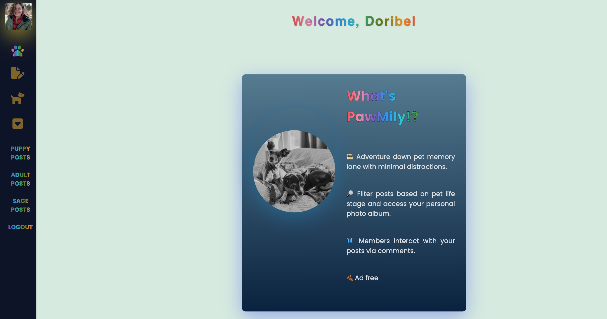
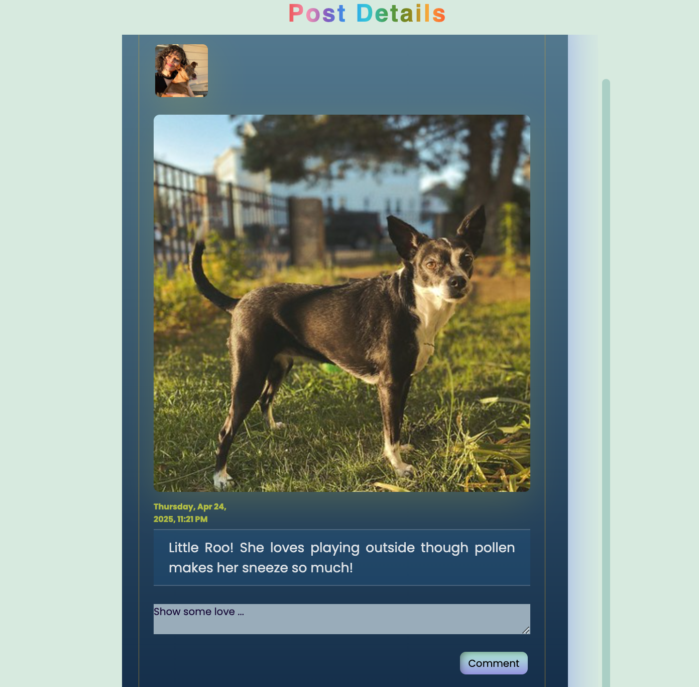

# `PawMily Album App`
***

## [PawMily Album App Link](https://pawmily-album.fly.dev/)
---
### `Description`
##### PawFamily App is a pet-focused app that encapsulates both social and meditative components. How? Users can engage with each others’ posts via comments while navigating a minimalist space where pet family members are at the limelight. We guarantee placing FOMO on the back burner while in our space. Check it out! 🐕 🐈‍⬛
---
PawMily Album app offers:

- [x] Adventure down pet memory lane with minimal distractions. 
- [x] Filter posts based on pet life stage and access your personal photo album.
- [x] Members interact with your posts via comments.
- [x] Ad free
---

### [Project Planning Material Link](https://trello.com/b/1ixhu1oN/pawmily-album)

---

### `Icebox Items`

- [x] AAU, I should be able to create a profile for my pet with embedded posts and embedded comments. 
- [x] AAU, I should be able to like posts.
- [x] AAU, I should be able to edit comments.
- [x] AAU, I should be able to filter my album photos.

***
 ### `Technology` 

- [x] `Google OAuth`
- [x] `Fly.io`
- [x] `Whimsical`
- [x] `Passport.js`
***

#### `Attributions Links`

- [x] [Favicon.cc](https://www.favicon.cc/)  
- [x] [coolors.co](https://coolors.co/gradients)  
- [x] [CSS Tips for Buttons](https://medium.com/)  
- [x] [Google Material Symbols](https://fonts.google.com/icons)  
- [x] [Rainbow Gradient](https://welearncode.com/rainbow-text/)  
- [x] [markdown-badges](https://github.com/Ileriayo/markdown-badges)  
- [x] [fonts.google](https://fonts.google.com/specimen/Dancing+Script)  
- [x] [Add Rating Buttons](https://youtu.be/20tJJAI6_oA?si=FHY0veTFNTHkk9Ys)  
- [x] [Hoot - Likes (Bonus](https://youtu.be/URaAMXYDc2U?si=Gtje_x21Y7D8V8Cp)  
- [x] [Responsive Side Nav Bar](https://www.youtube.com/watch?v=puOJox9p_YE&t=399s)  
- [x] [Instagram Post with Comment Box](https://www.youtube.com/watch?v=-N0Bew-0npk)  
- [x] [Build A Responsive Sidebard Menu](https://www.youtube.com/watch?v=uy1tgKOnPB0&t=646s)  
- [x] [Wrap Text Around a Circle - Quick CSS Tips And Tricks](https://www.youtube.com/watch?v=Gws3C4Phs2k)  
***